# Otto v2 - Architecture Documentation

This document provides detailed architecture diagrams for the Otto v2 system using Mermaid.js.

## Table of Contents
1. [High-Level System Architecture](#1-high-level-system-architecture)
2. [Core Components & Dependencies](#2-core-components--dependencies)
3. [Data Flow Architecture](#3-data-flow-architecture)
4. [Design Patterns Overview](#4-design-patterns-overview)
5. [Event Bus Architecture](#5-event-bus-architecture)
6. [Persistence Layer](#6-persistence-layer)
7. [UI Components Architecture](#7-ui-components-architecture)
8. [Shape & Binding System](#8-shape--binding-system)
9. [Plugin System Architecture](#9-plugin-system-architecture)
10. [Command & History System](#10-command--history-system)

---

## 1. High-Level System Architecture

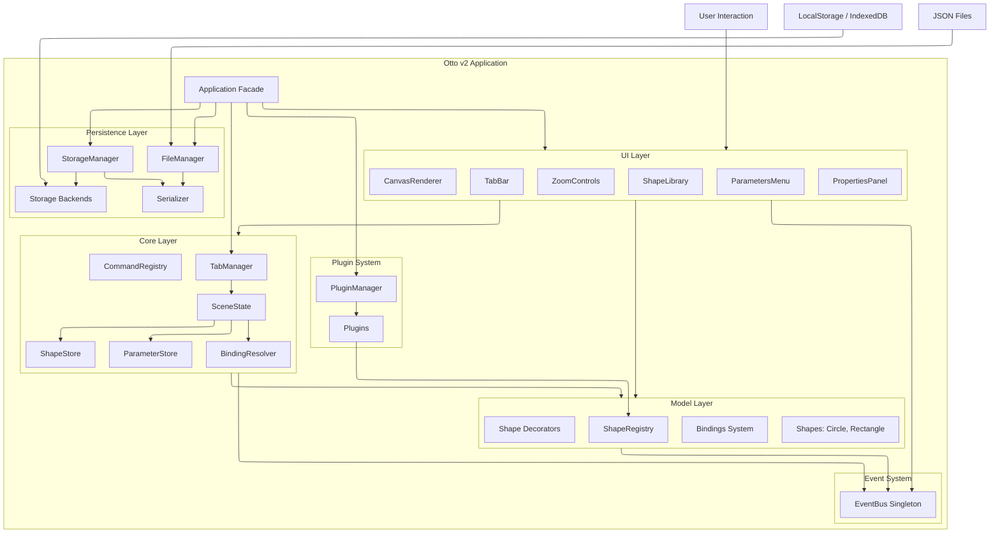

---

## 2. Core Components & Dependencies

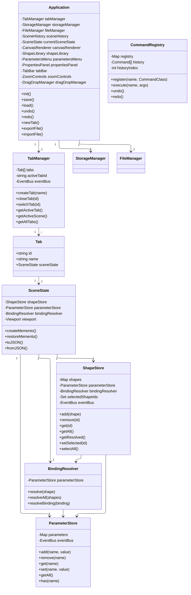

---

## 3. Data Flow Architecture

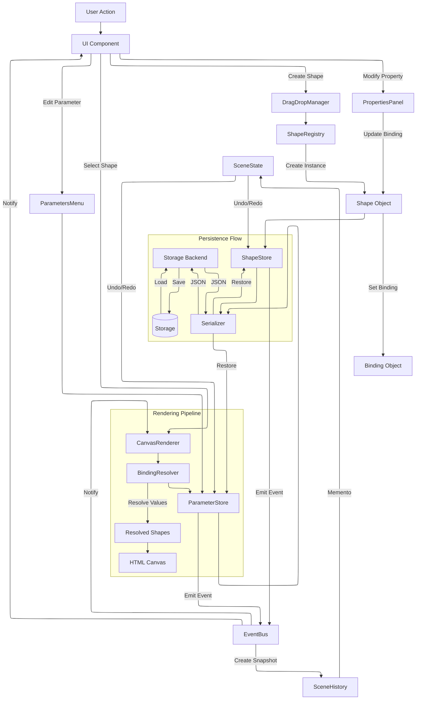

---

### Event Types

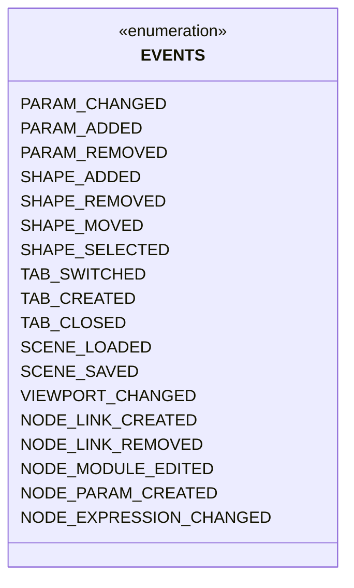

---

## 6. Persistence Layer

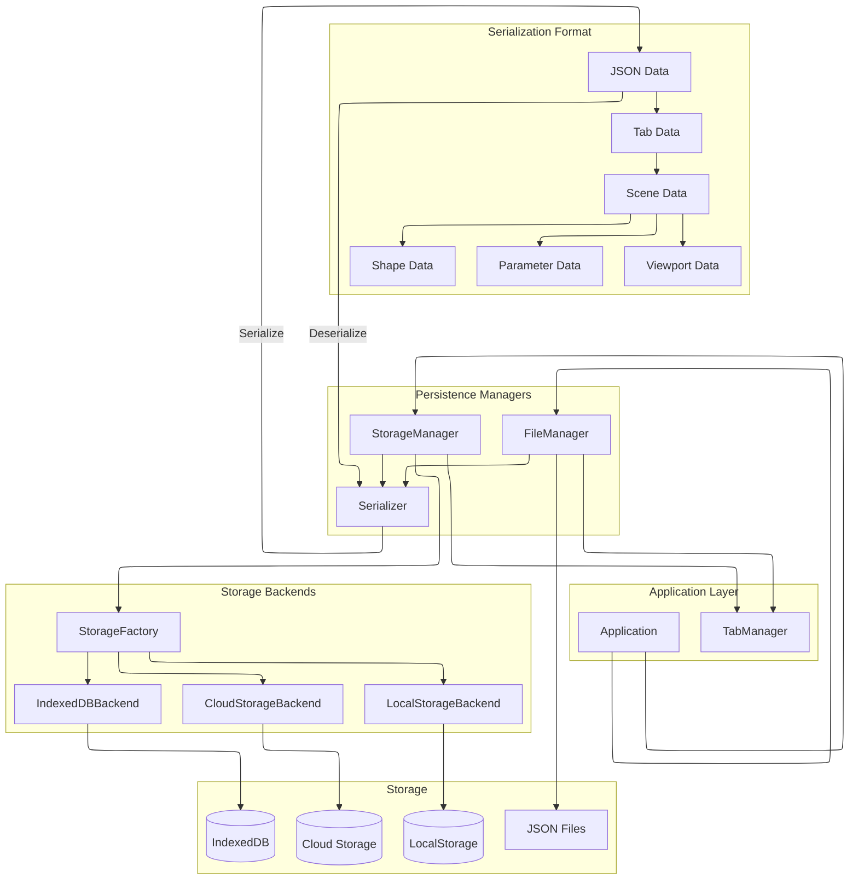

### Serialization Flow

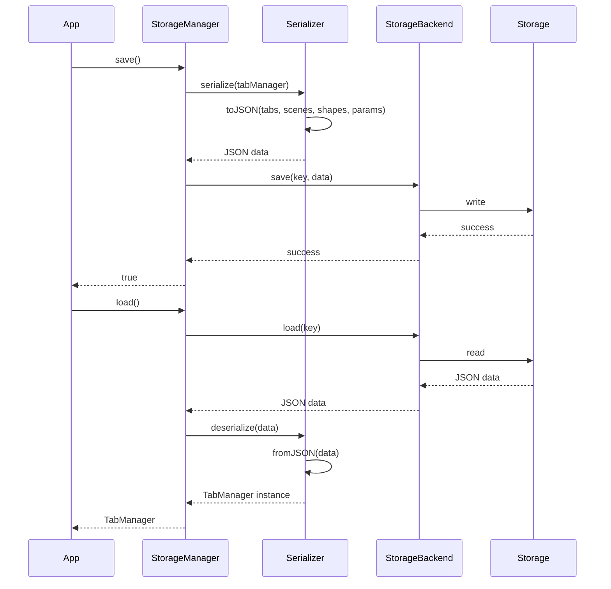

---

## 7. UI Components Architecture

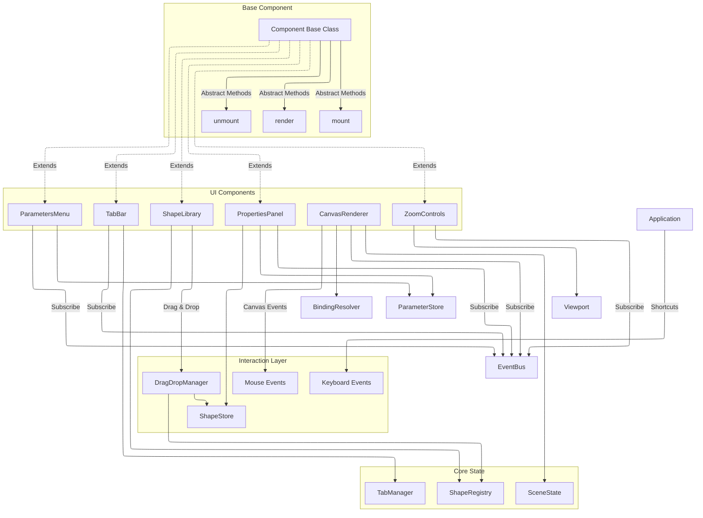

### Component Lifecycle

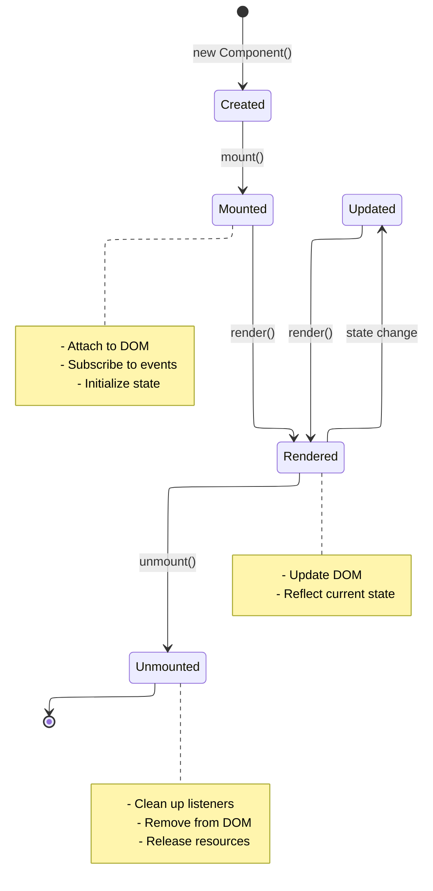

---

## 8. Shape & Binding System

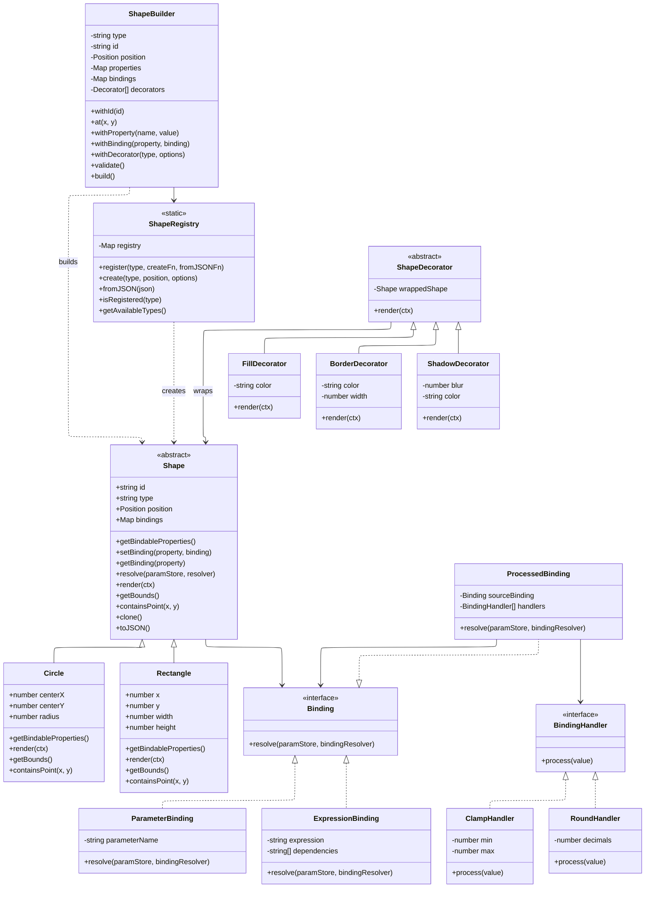

### Binding Resolution Flow

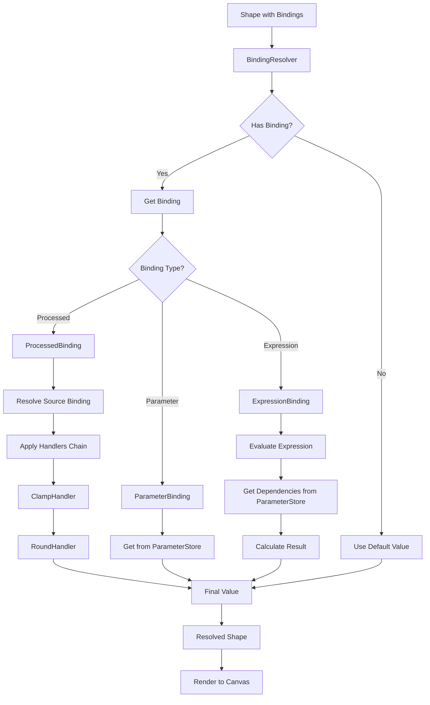

---

## 9. Plugin System Architecture

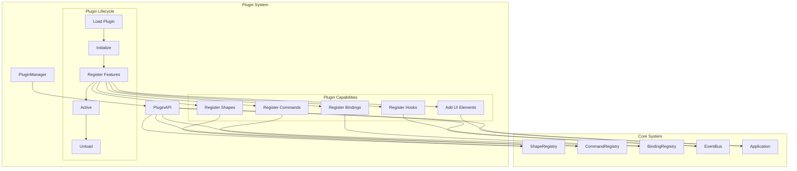

### Plugin Example

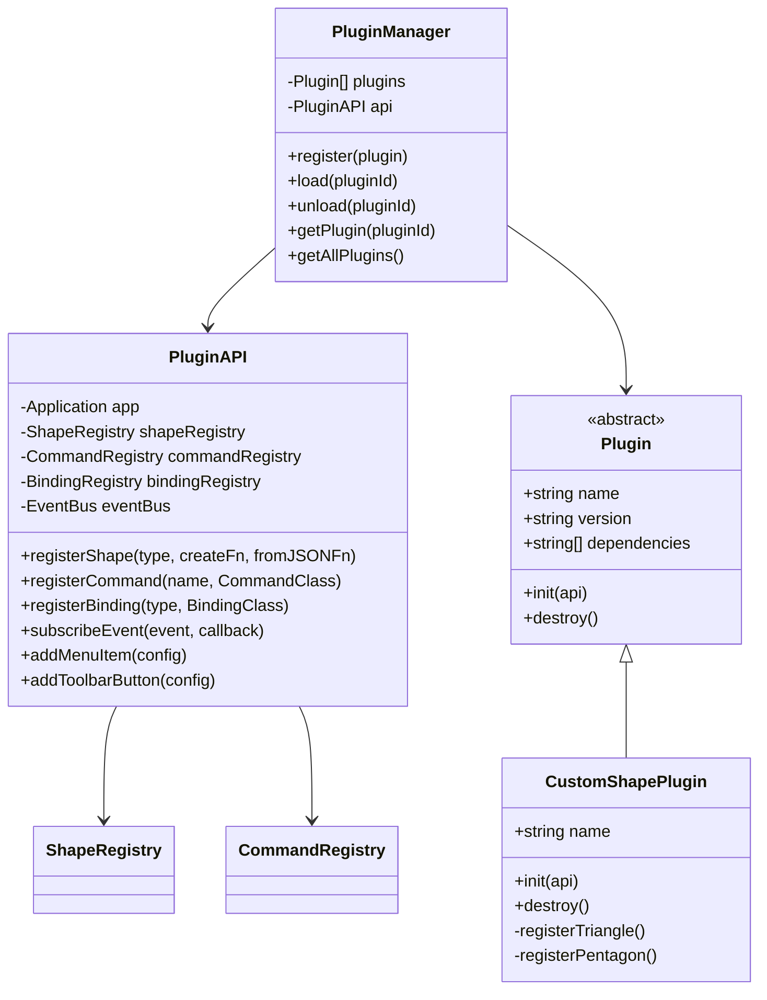

---

## 10. Command & History System

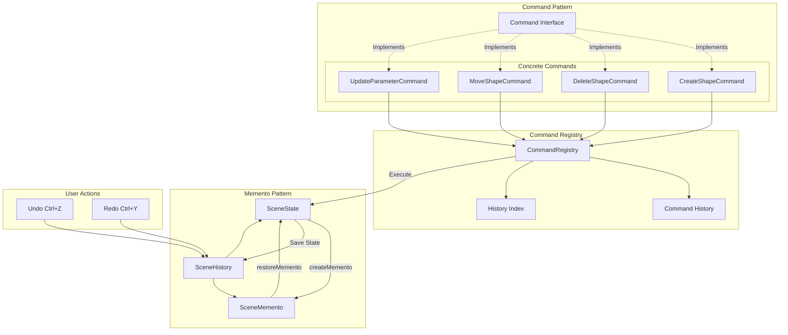

### History System Flow

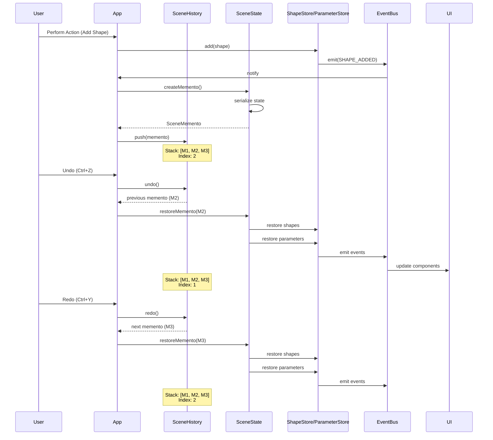

---

