# Otto v2 - Complete Architecture Documentation

This document provides comprehensive architecture documentation for the Otto v2 system, including high-level system design, geometry library, and assembly plan architecture.

**Notes**: UI measurements and rulers are in **mm**, and 100% zoom maps to a 300mm x 300mm canvas scale.

## Table of Contents

### Part 1: System Architecture
1. [High-Level System Architecture](#1-high-level-system-architecture)
2. [Core Components & Dependencies](#2-core-components--dependencies)
3. [Data Flow Architecture](#3-data-flow-architecture)
4. [Design Patterns Overview](#4-design-patterns-overview)
5. [Event Bus Architecture](#5-event-bus-architecture)
6. [Persistence Layer](#6-persistence-layer)
7. [UI Components Architecture](#7-ui-components-architecture)
8. [Shape & Binding System](#8-shape--binding-system)
9. [Plugin System Architecture](#9-plugin-system-architecture)
10. [Command & History System](#10-command--history-system)
11. [Blocks Editor Bidirectional Flow](#11-blocks-editor-bidirectional-flow)
12. [Edge Selection System](#12-edge-selection-system)
13. [Text-Based Programming System](#13-text-based-programming-system)
14. [Editor Sync Connector](#14-editor-sync-connector)
15. [Resize Handles & Shape Resizing](#15-resize-handles--shape-resizing)

### Part 2: Geometry Library Architecture
16. [Geometry Library Overview](#16-geometry-library-overview)
17. [Module Dependency Graph](#17-module-dependency-graph)
18. [API Conventions](#18-api-conventions)
19. [Geometry Library Implementation](#19-geometry-library-implementation)

### Part 3: Assembly Plan Architecture
20. [Assembly Plan Overview](#20-assembly-plan-overview)
21. [Assembly Data Flow](#21-assembly-data-flow)
22. [Assembly Components](#22-assembly-components)

---

## Part 1: System Architecture

## 1. High-Level System Architecture

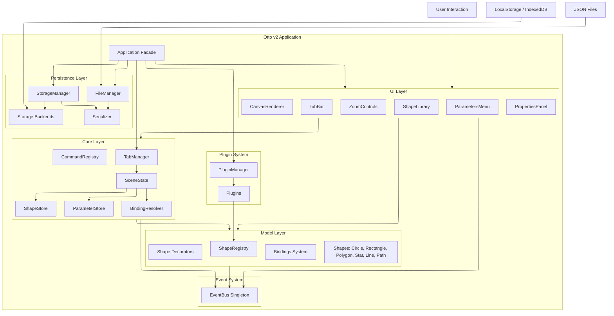
```mermaid
---
config:
  layout: elk
---
flowchart TB
 subgraph CoreLayer["Core Layer"]
        TM["TabManager"]
        SS["SceneState"]
        SH["ShapeStore"]
        PS["ParameterStore"]
        BR["BindingResolver"]
        CMD["CommandRegistry"]
  end
 subgraph UILayer["UI Layer"]
        TB["TabBar"]
        SL["ShapeLibrary"]
        CR["CanvasRenderer"]
        PM_UI["ParametersMenu"]
        PP["PropertiesPanel"]
        ZC["ZoomControls"]
  end
 subgraph ModelLayer["Model Layer"]
        SR["ShapeRegistry"]
        Shapes["Shapes: Circle, Rectangle, Polygon, Star, Line, Path"]
        Bindings["Bindings System"]
        Decorators["Shape Decorators"]
  end
 subgraph PersistenceLayer["Persistence Layer"]
        SM["StorageManager"]
        FM["FileManager"]
        SER["Serializer"]
        Backends["Storage Backends"]
  end
 subgraph EventSystem["Event System"]
        EB["EventBus Singleton"]
  end
 subgraph PluginSystem["Plugin System"]
        PM_Plugin["PluginManager"]
        Plugins["Plugins"]
  end
 subgraph OttoV2["Otto v2 Application"]
        App["Application Facade"]
        CoreLayer
        UILayer
        ModelLayer
        PersistenceLayer
        EventSystem
        PluginSystem
  end
    App --> TM & UILayer & SM & FM & PM_Plugin
    TM --> SS
    SS --> SH & PS & BR
    UILayer --> CoreLayer & ModelLayer & EB
    CoreLayer --> ModelLayer & EB
    SM --> SER & Backends
    FM --> SER
    PM_Plugin --> Plugins
    Plugins --> SR
    ModelLayer --> EB
    User["User Interaction"] --> UILayer
    Storage["LocalStorage / IndexedDB"] --> Backends
    Files["JSON Files"] --> FM
```

---

## 2. Core Components & Dependencies

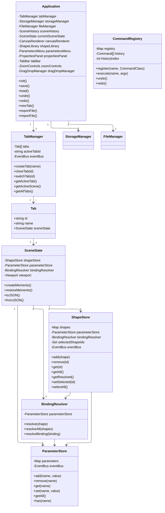
```mermaid
---
config:
  layout: elk
---
classDiagram
    class Application {
        -TabManager tabManager
        -StorageManager storageManager
        -FileManager fileManager
        -SceneHistory sceneHistory
        -SceneState currentSceneState
        -CanvasRenderer canvasRenderer
        -ShapeLibrary shapeLibrary
        -ParametersMenu parametersMenu
        -PropertiesPanel propertiesPanel
        -TabBar tabBar
        -ZoomControls zoomControls
        -DragDropManager dragDropManager
        +init()
        +save()
        +load()
        +undo()
        +redo()
        +newTab()
        +exportFile()
        +importFile()
    }

    class TabManager {
        -Tab[] tabs
        -string activeTabId
        -EventBus eventBus
        +createTab(name)
        +closeTab(id)
        +switchTab(id)
        +getActiveTab()
        +getActiveScene()
        +getAllTabs()
    }

    class Tab {
        +string id
        +string name
        +SceneState sceneState
    }

    class SceneState {
        -ShapeStore shapeStore
        -ParameterStore parameterStore
        -BindingResolver bindingResolver
        -Viewport viewport
        +createMemento()
        +restoreMemento()
        +toJSON()
        +fromJSON()
    }

    class ShapeStore {
        -Map shapes
        -ParameterStore parameterStore
        -BindingResolver bindingResolver
        -Set selectedShapeIds
        -EventBus eventBus
        +add(shape)
        +remove(id)
        +get(id)
        +getAll()
        +getResolved()
        +setSelected(id)
        +selectAll()
    }

    class ParameterStore {
        -Map parameters
        -EventBus eventBus
        +add(name, value)
        +remove(name)
        +get(name)
        +set(name, value)
        +getAll()
        +has(name)
    }

    class BindingResolver {
        -ParameterStore parameterStore
        +resolve(shape)
        +resolveAll(shapes)
        +resolveBinding(binding)
    }

    class CommandRegistry {
        -Map registry
        -Command[] history
        -int historyIndex
        +register(name, CommandClass)
        +execute(name, args)
        +undo()
        +redo()
    }

    Application "1" --> "1" TabManager
    Application "1" --> "1" StorageManager
    Application "1" --> "1" FileManager
    TabManager "1" --> "*" Tab
    Tab "1" --> "1" SceneState
    SceneState "1" --> "1" ShapeStore
    SceneState "1" --> "1" ParameterStore
    SceneState "1" --> "1" BindingResolver
    ShapeStore --> ParameterStore
    ShapeStore --> BindingResolver
    BindingResolver --> ParameterStore
```

---

## 3. Data Flow Architecture

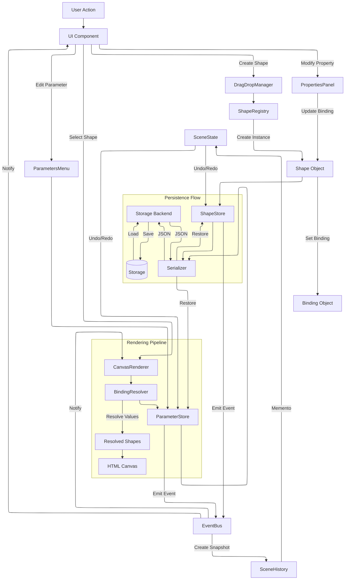
```mermaid
---
config:
  layout: elk
---
flowchart TB
    User[User Action] --> UI[UI Component]

    UI --> |Create Shape| DDM[DragDropManager]
    UI --> |Select Shape| CR[CanvasRenderer]
    UI --> |Edit Parameter| PM[ParametersMenu]
    UI --> |Modify Property| PP[PropertiesPanel]

    DDM --> SR[ShapeRegistry]
    SR --> |Create Instance| Shape[Shape Object]
    Shape --> SH[ShapeStore]

    SH --> |Emit Event| EB[EventBus]
    PM --> PS[ParameterStore]
    PS --> |Emit Event| EB

    PP --> |Update Binding| Shape
    Shape --> |Set Binding| Binding[Binding Object]

    EB --> |Notify| UI
    EB --> |Notify| CR
    EB --> |Create Snapshot| History[SceneHistory]

    subgraph "Rendering Pipeline"
        CR --> BR[BindingResolver]
        BR --> PS
        BR --> |Resolve Values| ResolvedShapes[Resolved Shapes]
        ResolvedShapes --> Canvas[HTML Canvas]
    end

    subgraph "Persistence Flow"
        SH --> Serializer
        PS --> Serializer
        Serializer --> |JSON| StorageBackend[Storage Backend]
        StorageBackend --> |Save| DB[(Storage)]
        DB --> |Load| StorageBackend
        StorageBackend --> |JSON| Serializer
        Serializer --> |Restore| SH
        Serializer --> |Restore| PS
    end

    History --> |Memento| SceneState[SceneState]
    SceneState --> |Undo/Redo| SH
    SceneState --> |Undo/Redo| PS
```

### Event Types

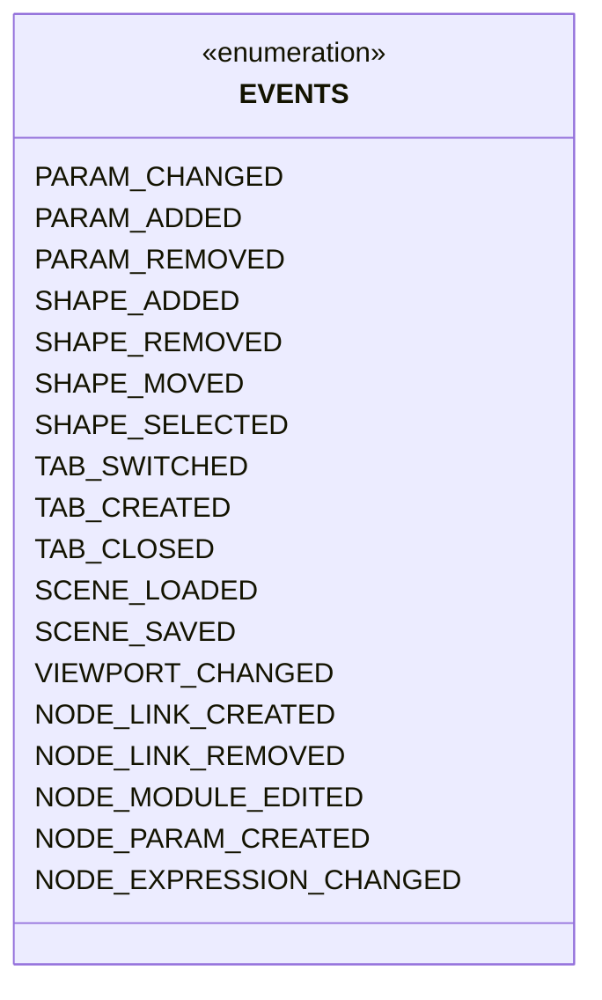
```mermaid
classDiagram
    class EVENTS {
        <<enumeration>>
        PARAM_CHANGED
        PARAM_ADDED
        PARAM_REMOVED
        SHAPE_ADDED
        SHAPE_REMOVED
        SHAPE_MOVED
        SHAPE_SELECTED
        TAB_SWITCHED
        TAB_CREATED
        TAB_CLOSED
        SCENE_LOADED
        SCENE_SAVED
        VIEWPORT_CHANGED
        NODE_LINK_CREATED
        NODE_LINK_REMOVED
        NODE_MODULE_EDITED
        NODE_PARAM_CREATED
        NODE_EXPRESSION_CHANGED
    }
```

---

## 6. Persistence Layer

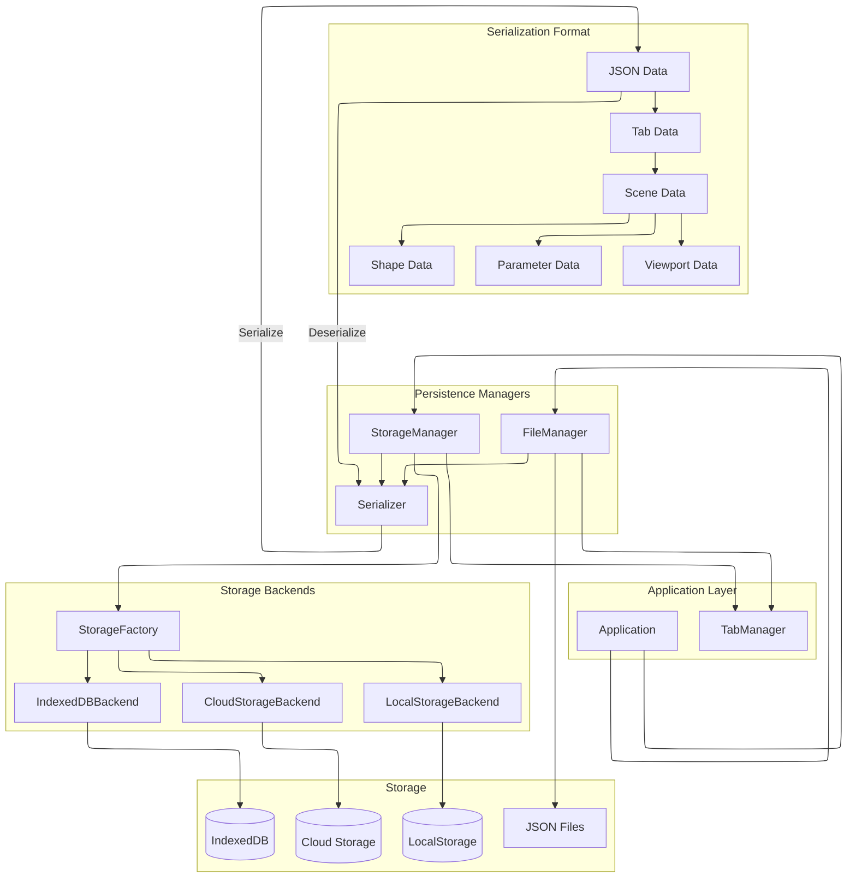
```mermaid
---
config:
  layout: elk
---
graph TB
    subgraph "Application Layer"
        App[Application]
        TM[TabManager]
    end

    subgraph "Persistence Managers"
        SM[StorageManager]
        FM[FileManager]
        SER[Serializer]
    end

    subgraph "Storage Backends"
        SF[StorageFactory]
        LSB[LocalStorageBackend]
        IDB[IndexedDBBackend]
        CSB[CloudStorageBackend]
    end

    subgraph "Storage"
        LS[(LocalStorage)]
        IDB_DB[(IndexedDB)]
        Cloud[(Cloud Storage)]
        File[JSON Files]
    end

    App --> SM
    App --> FM
    SM --> TM
    FM --> TM

    SM --> SER
    FM --> SER

    SM --> SF
    SF --> LSB
    SF --> IDB
    SF --> CSB

    LSB --> LS
    IDB --> IDB_DB
    CSB --> Cloud
    FM --> File

    SER -->|Serialize| JSON[JSON Data]
    JSON -->|Deserialize| SER

    subgraph "Serialization Format"
        JSON --> TabData[Tab Data]
        TabData --> SceneData[Scene Data]
        SceneData --> ShapeData[Shape Data]
        SceneData --> ParamData[Parameter Data]
        SceneData --> ViewportData[Viewport Data]
    end
```

### Serialization Flow

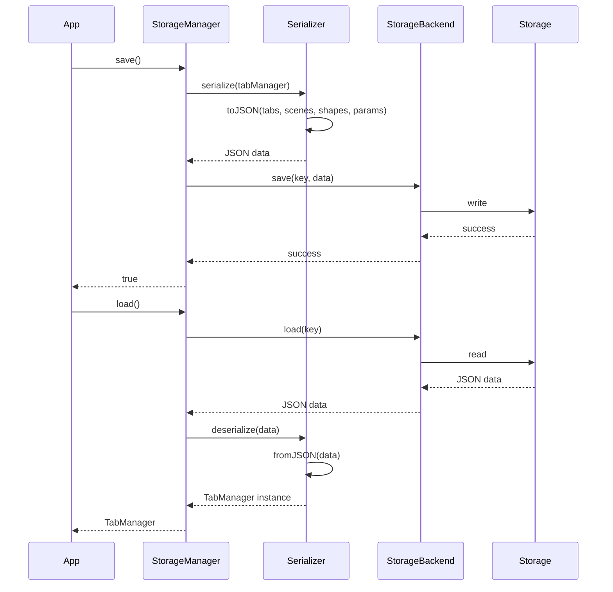
```mermaid
sequenceDiagram
    participant App
    participant SM as StorageManager
    participant SER as Serializer
    participant Backend as StorageBackend
    participant Storage as Storage

    App->>SM: save()
    SM->>SER: serialize(tabManager)
    SER->>SER: toJSON(tabs, scenes, shapes, params)
    SER-->>SM: JSON data
    SM->>Backend: save(key, data)
    Backend->>Storage: write
    Storage-->>Backend: success
    Backend-->>SM: success
    SM-->>App: true

    App->>SM: load()
    SM->>Backend: load(key)
    Backend->>Storage: read
    Storage-->>Backend: JSON data
    Backend-->>SM: JSON data
    SM->>SER: deserialize(data)
    SER->>SER: fromJSON(data)
    SER-->>SM: TabManager instance
    SM-->>App: TabManager
```

---

## 7. UI Components Architecture

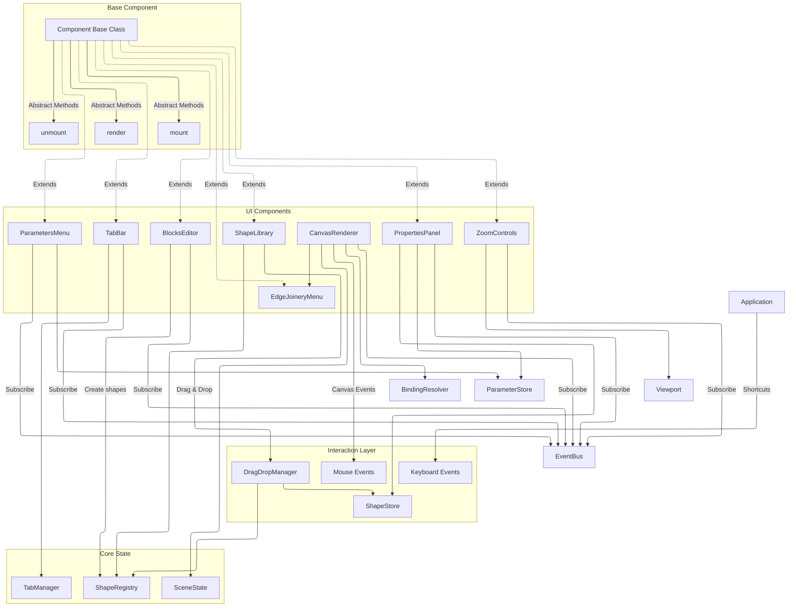
```mermaid

---
config:
  layout: elk
---

graph TB
    subgraph "Base Component"
        Component[Component Base Class]
        Component -->|Abstract Methods| mount
        Component -->|Abstract Methods| unmount
        Component -->|Abstract Methods| render
    end

    subgraph "UI Components"
        TB[TabBar]
        SL[ShapeLibrary]
        CR[CanvasRenderer]
        EJM[EdgeJoineryMenu]
        PM[ParametersMenu]
        PP[PropertiesPanel]
        ZC[ZoomControls]
        BE[BlocksEditor]
    end

    subgraph "Core State"
        TM[TabManager]
        SS[SceneState]
        SR[ShapeRegistry]
    end

    Component -.->|Extends| TB
    Component -.->|Extends| SL
    Component -.->|Extends| PM
    Component -.->|Extends| PP
    Component -.->|Extends| ZC
    Component -.->|Extends| BE
    Component -.->|Extends| EJM

    TB --> TM
    TB -->|Subscribe| EB[EventBus]

    SL --> SR
    SL -->|Drag & Drop| DDM[DragDropManager]

    CR --> SS
    CR --> BR[BindingResolver]
    CR -->|Subscribe| EB
    CR --> EJM

    BE -->|Create shapes| SR
    BE -->|Subscribe| EB

    PM --> PS[ParameterStore]
    PM -->|Subscribe| EB

    PP --> SH[ShapeStore]
    PP --> PS
    PP -->|Subscribe| EB

    ZC --> Viewport
    ZC -->|Subscribe| EB

    subgraph "Interaction Layer"
        DDM --> SH
        DDM --> SR
        Mouse[Mouse Events]
        Keyboard[Keyboard Events]
    end

    CR -->|Canvas Events| Mouse
    App[Application] -->|Shortcuts| Keyboard
```

### Component Lifecycle

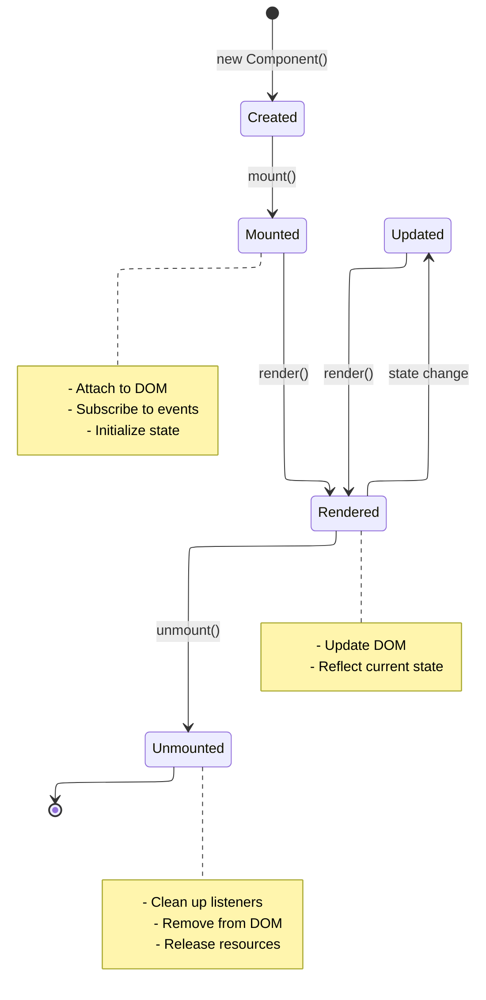
```mermaid
---
config:
  layout: elk
---
stateDiagram-v2
    [*] --> Created: new Component()
    Created --> Mounted: mount()
    Mounted --> Rendered: render()
    Rendered --> Updated: state change
    Updated --> Rendered: render()
    Rendered --> Unmounted: unmount()
    Unmounted --> [*]

    note right of Mounted
        - Attach to DOM
        - Subscribe to events
        - Initialize state
    end note

    note right of Rendered
        - Update DOM
        - Reflect current state
    end note

    note right of Unmounted
        - Clean up listeners
        - Remove from DOM
        - Release resources
    end note
```

---

## 11. Blocks Editor Bidirectional Flow

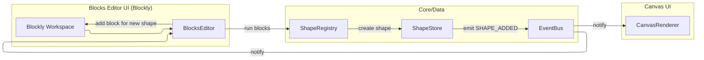
```mermaid
---
config:
  layout: elk
---
flowchart LR
  subgraph BlocksUI["Blocks Editor UI (Blockly)"]
    BE["BlocksEditor"]
    WS["Blockly Workspace"]
  end

  subgraph CanvasUI["Canvas UI"]
    CR["CanvasRenderer"]
  end

  subgraph Core["Core/Data"]
    SS["ShapeStore"]
    SR["ShapeRegistry"]
    EB["EventBus"]
  end

  WS --> BE
  BE -->|run blocks| SR
  SR -->|create shape| SS
  SS -->|emit SHAPE_ADDED| EB
  EB -->|notify| CR
  EB -->|notify| BE
  BE -->|add block for new shape| WS
```

**Notes**
1. Blocks → Canvas: user clicks **Add Shapes**, BlocksEditor reads the Blockly workspace, creates shapes via ShapeRegistry, and adds them to ShapeStore.
2. Canvas → Blocks: whenever ShapeStore emits `SHAPE_ADDED` (from any source), BlocksEditor appends a new block representing that shape.
3. CanvasRenderer listens to `SHAPE_ADDED` and re-renders the canvas.

---

## 14. Editor Sync Connector

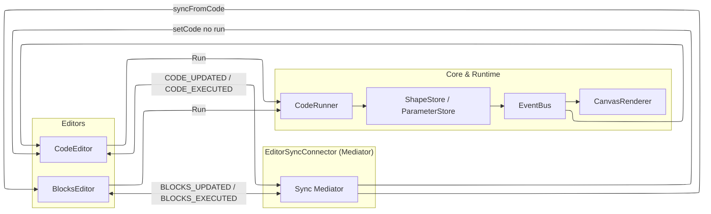
```mermaid
---
config:
  layout: elk
---
flowchart LR
  subgraph Editors["Editors"]
    CE["CodeEditor"]
    BE["BlocksEditor"]
  end

  subgraph Connector["EditorSyncConnector (Mediator)"]
    ESC["Sync Mediator"]
  end

  subgraph Core["Core & Runtime"]
    CR["CodeRunner"]
    SS["ShapeStore / ParameterStore"]
    EB["EventBus"]
    Canvas["CanvasRenderer"]
  end

  CE <-->|CODE_UPDATED / CODE_EXECUTED| ESC
  BE <-->|BLOCKS_UPDATED / BLOCKS_EXECUTED| ESC
  ESC -->|syncFromCode| BE
  ESC -->|setCode no run| CE

  CE -->|Run| CR
  BE -->|Run| CR
  CR --> SS
  SS --> EB
  EB --> Canvas
  EB --> CE

```

**Design Patterns**
1. **Mediator Pattern**: `EditorSyncConnector` centralizes coordination so CodeEditor and BlocksEditor never call each other directly.
2. **Observer Pattern**: `EventBus` distributes `CODE_UPDATED`, `CODE_EXECUTED`, `BLOCKS_UPDATED`, `BLOCKS_EXECUTED` events.
3. **Adapter Pattern**: Blockly generators and AST-to-block builders adapt between text AST and visual blocks.

---

## 15. Resize Handles & Shape Resizing

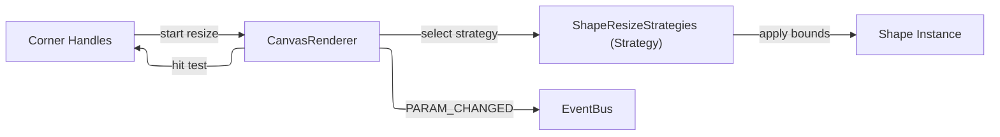
```mermaid
---
config:
  layout: elk
---
flowchart LR
  Canvas["CanvasRenderer"]
  Handles["Corner Handles"]
  Strategy["ShapeResizeStrategies (Strategy)"]
  Shape["Shape Instance"]
  Bus["EventBus"]

  Canvas -->|hit test| Handles
  Handles -->|start resize| Canvas
  Canvas -->|select strategy| Strategy
  Strategy -->|apply bounds| Shape
  Canvas -->|PARAM_CHANGED| Bus
```

**What happens**
1. The four corner brackets act as resize handles. Mouse-down on a corner starts a resize drag.
2. CanvasRenderer computes new bounds from the dragged corner and asks a shape-specific strategy to apply those bounds.
3. During resize, selection overlays (brackets + dimension labels) read **live mutable shape bounds** so measurements stay accurate while dragging.
4. The shape updates live while dragging, then emits `PARAM_CHANGED` on mouse-up so Code and Blocks sync.

**Design Pattern: Strategy**
- **What**: Each shape type has a resizing strategy in `ShapeResizeStrategies` that translates bounding-box changes into shape parameters.
- **Why**: It keeps CanvasRenderer generic and makes it easy to add/modify resize rules per shape without touching input-handling code.

---

## 8. Shape & Binding System

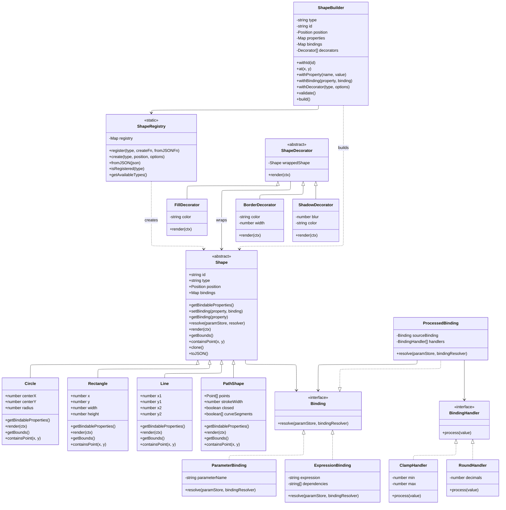
```mermaid
---
config:
  layout: elk
---
classDiagram
    class Shape {
        <<abstract>>
        +string id
        +string type
        +Position position
        +Map bindings
        +getBindableProperties()
        +setBinding(property, binding)
        +getBinding(property)
        +resolve(paramStore, resolver)
        +render(ctx)
        +getBounds()
        +containsPoint(x, y)
        +clone()
        +toJSON()
    }

    class Circle {
        +number centerX
        +number centerY
        +number radius
        +getBindableProperties()
        +render(ctx)
        +getBounds()
        +containsPoint(x, y)
    }

    class Rectangle {
        +number x
        +number y
        +number width
        +number height
        +getBindableProperties()
        +render(ctx)
        +getBounds()
        +containsPoint(x, y)
    }

    class Line {
        +number x1
        +number y1
        +number x2
        +number y2
        +getBindableProperties()
        +render(ctx)
        +getBounds()
        +containsPoint(x, y)
    }

    class PathShape {
        +Point[] points
        +number strokeWidth
        +boolean closed
        +boolean[] curveSegments
        +getBindableProperties()
        +render(ctx)
        +getBounds()
        +containsPoint(x, y)
    }

    class ShapeRegistry {
        <<static>>
        -Map registry
        +register(type, createFn, fromJSONFn)
        +create(type, position, options)
        +fromJSON(json)
        +isRegistered(type)
        +getAvailableTypes()
    }

    class ShapeBuilder {
        -string type
        -string id
        -Position position
        -Map properties
        -Map bindings
        -Decorator[] decorators
        +withId(id)
        +at(x, y)
        +withProperty(name, value)
        +withBinding(property, binding)
        +withDecorator(type, options)
        +validate()
        +build()
    }

    class Binding {
        <<interface>>
        +resolve(paramStore, bindingResolver)
    }

    class ParameterBinding {
        -string parameterName
        +resolve(paramStore, bindingResolver)
    }

    class ExpressionBinding {
        -string expression
        -string[] dependencies
        +resolve(paramStore, bindingResolver)
    }

    class ProcessedBinding {
        -Binding sourceBinding
        -BindingHandler[] handlers
        +resolve(paramStore, bindingResolver)
    }

    class BindingHandler {
        <<interface>>
        +process(value)
    }

    class ClampHandler {
        -number min
        -number max
        +process(value)
    }

    class RoundHandler {
        -number decimals
        +process(value)
    }

    class ShapeDecorator {
        <<abstract>>
        -Shape wrappedShape
        +render(ctx)
    }

    class FillDecorator {
        -string color
        +render(ctx)
    }

    class BorderDecorator {
        -string color
        -number width
        +render(ctx)
    }

    class ShadowDecorator {
        -number blur
        -string color
        +render(ctx)
    }

    Shape <|-- Circle
    Shape <|-- Rectangle
    Shape <|-- Line
    Shape <|-- PathShape
    Shape --> Binding

    Binding <|.. ParameterBinding
    Binding <|.. ExpressionBinding
    Binding <|.. ProcessedBinding

    ProcessedBinding --> Binding
    ProcessedBinding --> BindingHandler

    BindingHandler <|.. ClampHandler
    BindingHandler <|.. RoundHandler

    ShapeRegistry ..> Shape : creates
    ShapeBuilder ..> Shape : builds
    ShapeBuilder --> ShapeRegistry

    ShapeDecorator <|-- FillDecorator
    ShapeDecorator <|-- BorderDecorator
    ShapeDecorator <|-- ShadowDecorator
    ShapeDecorator --> Shape : wraps
```

### Binding Resolution Flow

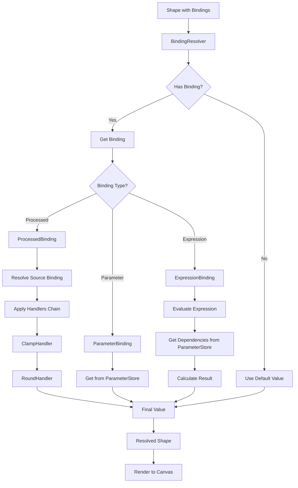
```mermaid
flowchart TB
    Start[Shape with Bindings] --> BR[BindingResolver]
    BR --> Check{Has Binding?}

    Check -->|Yes| GetBinding[Get Binding]
    Check -->|No| UseDefault[Use Default Value]

    GetBinding --> Type{Binding Type?}

    Type -->|Parameter| PB[ParameterBinding]
    Type -->|Expression| EB[ExpressionBinding]
    Type -->|Processed| PRB[ProcessedBinding]

    PB --> PS[Get from ParameterStore]
    EB --> Eval[Evaluate Expression]
    PRB --> SB[Resolve Source Binding]

    Eval --> Deps[Get Dependencies from ParameterStore]
    Deps --> Calc[Calculate Result]

    SB --> Handlers[Apply Handlers Chain]
    Handlers --> Clamp[ClampHandler]
    Clamp --> Round[RoundHandler]
    Round --> Final

    PS --> Final[Final Value]
    Calc --> Final
    UseDefault --> Final

    Final --> ResolvedShape[Resolved Shape]
    ResolvedShape --> Render[Render to Canvas]
```

---

## 9. Plugin System Architecture

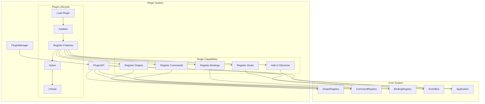
```mermaid
graph TB
    subgraph "Plugin System"
        PM[PluginManager]
        PA[PluginAPI]

        subgraph "Plugin Lifecycle"
            Load[Load Plugin]
            Init[Initialize]
            Register[Register Features]
            Active[Active]
            Unload[Unload]
        end

        subgraph "Plugin Capabilities"
            RS[Register Shapes]
            RC[Register Commands]
            RB[Register Bindings]
            UI[Add UI Elements]
            Hooks[Register Hooks]
        end
    end

    subgraph "Core System"
        SR[ShapeRegistry]
        CR_Core[CommandRegistry]
        BR_Core[BindingRegistry]
        EB[EventBus]
        App[Application]
    end

    PM --> PA
    PA --> SR
    PA --> CR_Core
    PA --> BR_Core
    PA --> EB
    PA --> App

    Load --> Init
    Init --> Register
    Register --> Active
    Active --> Unload

    Register --> RS
    Register --> RC
    Register --> RB
    Register --> UI
    Register --> Hooks

    RS --> SR
    RC --> CR_Core
    RB --> BR_Core
    UI --> App
    Hooks --> EB
```

### Plugin Example

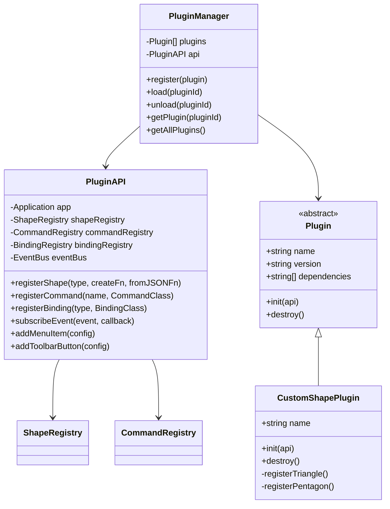
```mermaid
classDiagram
    class Plugin {
        <<abstract>>
        +string name
        +string version
        +string[] dependencies
        +init(api)
        +destroy()
    }

    class PluginAPI {
        -Application app
        -ShapeRegistry shapeRegistry
        -CommandRegistry commandRegistry
        -BindingRegistry bindingRegistry
        -EventBus eventBus
        +registerShape(type, createFn, fromJSONFn)
        +registerCommand(name, CommandClass)
        +registerBinding(type, BindingClass)
        +subscribeEvent(event, callback)
        +addMenuItem(config)
        +addToolbarButton(config)
    }

    class PluginManager {
        -Plugin[] plugins
        -PluginAPI api
        +register(plugin)
        +load(pluginId)
        +unload(pluginId)
        +getPlugin(pluginId)
        +getAllPlugins()
    }

    class CustomShapePlugin {
        +string name
        +init(api)
        +destroy()
        -registerTriangle()
        -registerPentagon()
    }

    PluginManager --> PluginAPI
    PluginManager --> Plugin
    Plugin <|-- CustomShapePlugin
    PluginAPI --> ShapeRegistry
    PluginAPI --> CommandRegistry
```

---

## 10. Command & History System

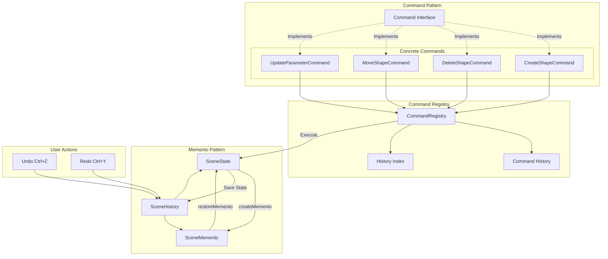
```mermaid
graph TB
    subgraph "Command Pattern"
        CMD[Command Interface]

        subgraph "Concrete Commands"
            CreateShape[CreateShapeCommand]
            DeleteShape[DeleteShapeCommand]
            MoveShape[MoveShapeCommand]
            UpdateParam[UpdateParameterCommand]
        end

        CMD -.->|Implements| CreateShape
        CMD -.->|Implements| DeleteShape
        CMD -.->|Implements| MoveShape
        CMD -.->|Implements| UpdateParam
    end

    subgraph "Command Registry"
        CR[CommandRegistry]
        History[Command History]
        Index[History Index]

        CR --> History
        CR --> Index
    end

    subgraph "Memento Pattern"
        Originator[SceneState]
        Memento[SceneMemento]
        Caretaker[SceneHistory]

        Originator -->|createMemento| Memento
        Memento -->|restoreMemento| Originator
        Caretaker --> Memento
    end

    CreateShape --> CR
    DeleteShape --> CR
    MoveShape --> CR
    UpdateParam --> CR

    CR -->|Execute| Originator
    Originator -->|Save State| Caretaker

    subgraph "User Actions"
        Undo[Undo Ctrl+Z]
        Redo[Redo Ctrl+Y]
    end

    Undo --> Caretaker
    Redo --> Caretaker
    Caretaker --> Originator
```

### History System Flow

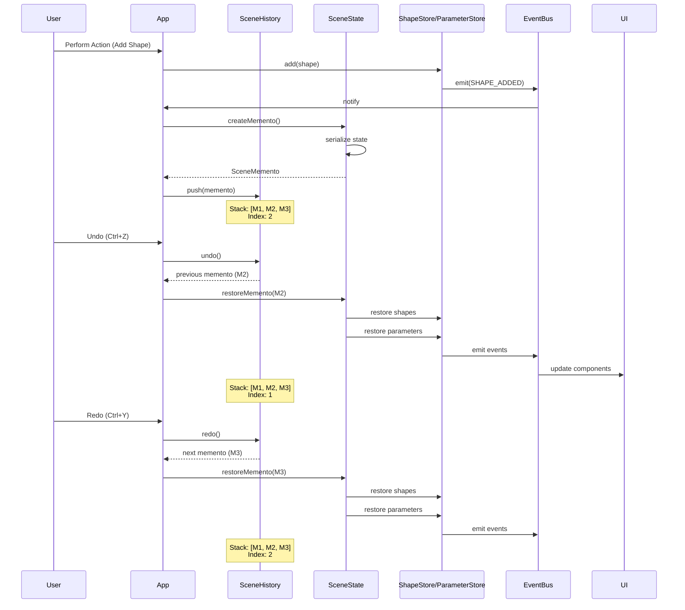
```mermaid
sequenceDiagram
    participant User
    participant App
    participant History as SceneHistory
    participant Scene as SceneState
    participant Store as ShapeStore/ParameterStore

    User->>App: Perform Action (Add Shape)
    App->>Store: add(shape)
    Store->>EventBus: emit(SHAPE_ADDED)
    EventBus->>App: notify
    App->>Scene: createMemento()
    Scene->>Scene: serialize state
    Scene-->>App: SceneMemento
    App->>History: push(memento)

    Note over History: Stack: [M1, M2, M3]<br/>Index: 2

    User->>App: Undo (Ctrl+Z)
    App->>History: undo()
    History-->>App: previous memento (M2)
    App->>Scene: restoreMemento(M2)
    Scene->>Store: restore shapes
    Scene->>Store: restore parameters
    Store->>EventBus: emit events
    EventBus->>UI: update components

    Note over History: Stack: [M1, M2, M3]<br/>Index: 1

    User->>App: Redo (Ctrl+Y)
    App->>History: redo()
    History-->>App: next memento (M3)
    App->>Scene: restoreMemento(M3)
    Scene->>Store: restore shapes
    Scene->>Store: restore parameters
    Store->>EventBus: emit events

    Note over History: Stack: [M1, M2, M3]<br/>Index: 2
```

---

## 12. Edge Selection System

The Edge Selection System allows users to select individual edges (sides) of any shape. Since all shapes are defined as paths using the geometry library, edges can be extracted and manipulated independently.

### Edge Selection Architecture

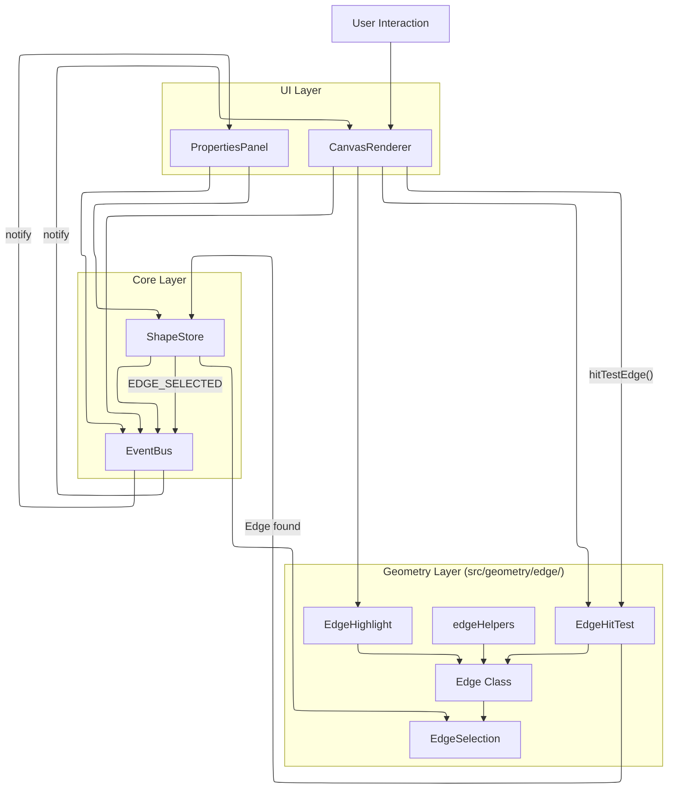
```mermaid
---
config:
  layout: elk
---
flowchart TB
    subgraph GeometryLayer["Geometry Layer (src/geometry/edge/)"]
        Edge["Edge Class"]
        EdgeSelection["EdgeSelection"]
        EdgeHitTest["EdgeHitTest"]
        EdgeHighlight["EdgeHighlight"]
        EdgeHelpers["edgeHelpers"]
    end

    subgraph CoreLayer["Core Layer"]
        ShapeStore["ShapeStore"]
        EventBus["EventBus"]
    end

    subgraph UILayer["UI Layer"]
        CanvasRenderer["CanvasRenderer"]
        PropertiesPanel["PropertiesPanel"]
    end

    Edge --> EdgeSelection
    EdgeHelpers --> Edge
    EdgeHitTest --> Edge
    EdgeHighlight --> Edge

    ShapeStore --> EdgeSelection
    ShapeStore --> EventBus

    CanvasRenderer --> EdgeHitTest
    CanvasRenderer --> EdgeHighlight
    CanvasRenderer --> EventBus

    PropertiesPanel --> ShapeStore
    PropertiesPanel --> EventBus

    User["User Interaction"] --> CanvasRenderer
    CanvasRenderer -->|"hitTestEdge()"| EdgeHitTest
    EdgeHitTest -->|"Edge found"| ShapeStore
    ShapeStore -->|"EDGE_SELECTED"| EventBus
    EventBus -->|"notify"| CanvasRenderer
    EventBus -->|"notify"| PropertiesPanel
```

### Edge Module Structure

```
src/geometry/edge/
├── Edge.js           # Core Edge class (segment between two anchors)
├── EdgeSelection.js  # Manages selection state for edges
├── EdgeHitTest.js    # Hit testing utilities for edge detection
├── EdgeHighlight.js  # Visual rendering for edge highlights
├── edgeHelpers.js    # Utility functions for edge extraction
├── index.js          # Module exports
└── tests/
    └── Edge.test.js  # Unit tests
```

### Edge Joinery Context Menu

The Edge Joinery context menu is a lightweight UI overlay triggered by right-clicking a hit-tested edge on the canvas. The menu lives outside the canvas and is owned by `CanvasRenderer`, which passes the hit edge into `EdgeJoineryMenu` for configuration.

Key responsibilities:
- `CanvasRenderer`: performs edge hit testing on right-click and opens the menu.
- `EdgeJoineryMenu`: displays joint type options and collects parameters (thickness in mm and finger count).
- `ShapeStore`: stores joinery metadata keyed by edge identity (`shapeId:pathIndex:index`) so it can persist across saves.
- `CanvasRenderer`: renders a lightweight joinery preview overlay on the edge based on stored metadata.

Joinery parameters:
- `type`: `finger_male` (outgoing) or `finger_female` (ingoing).
- `thicknessMm`: depth of the fingers in millimeters.
- `fingerCount`: number of fingers along the edge (minimum 2).

Data flow:
1. User right-clicks an edge on canvas.
2. `CanvasRenderer.hitTestEdge()` returns an `Edge` and opens `EdgeJoineryMenu`.
3. User selects joint type, thickness, and finger count.
4. `ShapeStore.setEdgeJoinery(edge, data)` stores joinery metadata and emits `EDGE_JOINERY_CHANGED`.
5. `CanvasRenderer` re-renders and draws a joinery preview along the edge.

Joinery preview flow:

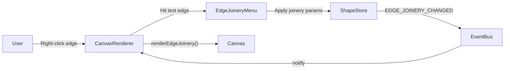
```mermaid
flowchart LR
    User["User"] -->|"Right-click edge"| CR["CanvasRenderer"]
    CR -->|"Hit test edge"| EJM["EdgeJoineryMenu"]
    EJM -->|"Apply joinery params"| SS["ShapeStore"]
    SS -->|"EDGE_JOINERY_CHANGED"| EB["EventBus"]
    EB -->|"notify"| CR
    CR -->|"renderEdgeJoinery()"| Canvas["Canvas"]
```

---

## 13. Text-Based Programming System

The Otto programming module provides a text-based language for parametric shape creation. Ported from Otto-main copy and adapted to work with Otto v2's shape and geometry systems.

### Architecture Overview

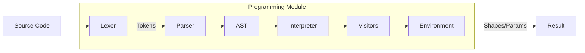
```mermaid
flowchart LR
    subgraph Programming["Programming Module"]
        Lexer["Lexer"]
        Parser["Parser"]
        AST["AST"]
        Interpreter["Interpreter"]
        Visitors["Visitors"]
        Environment["Environment"]
    end
    
    Code["Source Code"] --> Lexer
    Lexer --> |Tokens| Parser
    Parser --> AST
    AST --> Interpreter
    Interpreter --> Visitors
    Visitors --> Environment
    Environment --> |Shapes/Params| Result["Result"]
```

### Components

| File | Purpose |
|------|---------|
| `Lexer.js` | Tokenizes source code into tokens (keywords, identifiers, numbers, operators) |
| `Parser.js` | Builds Abstract Syntax Tree (AST) from tokens |
| `Interpreter.js` | Executes AST using Visitor pattern |
| `InterpreterVisitors.js` | Specialized visitors for expressions, shapes, control flow, etc. |
| `Environment.js` | Scoped variable storage with frames (parameters, shapes, layers) |
| `TurtleDrawer.js` | Logo-style turtle graphics for path drawing |
| `BooleanOperators.js` | Polygon clipping operations (union, difference, intersection) using ClipperLib |

### Language Syntax

```javascript
// Parameters
param size = 50
param count = 5

// Shapes
shape myCircle = circle { radius: size }
shape myRect = rectangle { width: 100, height: 80 }
shape myStar = star { outerRadius: 50, innerRadius: 25, points: count }

// Transforms
transform myCircle {
    position: [100, 100]
    rotation: 45
    scale: [1.5, 1.5]
}

// Boolean Operations
union result = myCircle, myRect
difference hole = myRect, myCircle
intersection overlap = myCircle, myRect

// Control Flow
for i from 0 to 5 {
    shape circle_{i} = circle { radius: 10 + i * 5 }
}

if size > 30 {
    shape largeShape = circle { radius: size }
}

// Functions
def createGear(teeth, size) {
    shape gear = gear { teeth: teeth, pitchDiameter: size }
    return gear
}

// Turtle Graphics (Draw)
draw myPath {
    forward 100
    right 90
    forward 50
    left 45
    backward 25
}
```

### Supported Shape Types

All shapes use our geometry library conventions:

| Shape | Parameters |
|-------|------------|
| `circle` | `radius` |
| `rectangle` | `width`, `height` |
| `triangle` | `base`, `height` |
| `ellipse` | `radiusX`, `radiusY` |
| `polygon` | `radius`, `sides` |
| `star` | `outerRadius`, `innerRadius`, `points` |
| `arc` | `radius`, `startAngle`, `endAngle` |
| `roundedRectangle` | `width`, `height`, `radius` |
| `donut` | `outerRadius`, `innerRadius` |
| `cross` | `width`, `thickness` |
| `gear` | `pitchDiameter`, `teeth`, `pressureAngle` |
| `spiral` | `startRadius`, `endRadius`, `turns` |
| `wave` | `width`, `amplitude`, `frequency` |
| `slot` | `length`, `width` |
| `arrow` | `length`, `headWidth`, `headLength` |
| `chamferRectangle` | `width`, `height`, `chamfer` |

### Design Patterns Used

1. **Visitor Pattern**: Interpreter uses visitors for each AST node type
2. **Scope Chain**: Environment uses frame-based scoping with parent lookup
3. **Factory Pattern**: ShapeGenerators create point arrays for boolean operations
4. **Strategy Pattern**: Different visitors handle different node types
5. **Mediator Pattern**: EditorSyncConnector orchestrates Code ↔ Blocks ↔ Canvas synchronization
6. **Observer Pattern**: EventBus propagates editor and scene change events

---

## Part 2: Geometry Library Architecture

## 16. Geometry Library Overview

This library provides comprehensive 2D geometry primitives and operations for parametric design:
- Vector math and transformations
- Bezier curves and paths
- Boolean operations on shapes
- SVG import/export
- Canvas rendering

---

## 17. Module Dependency Graph

```
Layer 1: Foundation (no dependencies)
├── constants.js    - Mathematical constants, tolerances
├── math.js         - Trigonometry, interpolation, comparison utilities
└── util.js         - Array helpers (range, pairs, rotateArray)

Layer 2: Core Primitives
├── Vec.js          - 2D vector class (depends on: constants, math)
└── Matrix.js       - AffineMatrix, Transform (depends on: constants, math, Vec)

Layer 3: Support Types
├── BoundingBox.js  - Axis-aligned bounding box (depends on: Vec)
├── Color.js        - RGBA/HSV color (depends on: math)
└── Style.js        - Stroke, Fill classes (depends on: Color)

Layer 4: Geometry Base
├── Geometry.js     - Abstract base class (depends on: Vec, Matrix, BoundingBox, Style)
└── Anchor.js       - Path anchor points (depends on: Vec, Matrix, BoundingBox, Geometry)

Layer 5: Curve Mathematics
├── bezier.js       - Bernstein polynomials, root finding (depends on: Vec)
└── Segment.js      - Line/Cubic operations, intersections (depends on: Vec, Anchor, bezier, BoundingBox)

Layer 6: Path System
└── Path.js         - Main path class (depends on: Anchor, Segment, Matrix, BoundingBox, Style, Geometry)

Layer 7: Complex Geometry
├── Shape.js        - Multi-path shapes (depends on: Path, pathkit)
├── Group.js        - Geometry container (depends on: Path, Shape, Geometry)
└── Axis.js         - Axis helper (depends on: Vec, Geometry)

Layer 8: I/O & Rendering
├── canvas.js       - Canvas 2D rendering (depends on: Path, Shape, Style)
├── svg.js          - SVG import/export (depends on: Path, Shape, Style)
└── pathkit.js      - Skia PathKit wrapper (external dependency)

Layer 9: Entry Point
└── index.js        - Re-exports all public APIs
```

## Build Order

Files must be created in dependency order:

| Phase | Files | Description |
|-------|-------|-------------|
| 1 | constants, math, util | Foundation - no deps |
| 2 | Vec, Matrix | Core primitives |
| 3 | BoundingBox, Color, Style | Support types |
| 4 | Geometry, Anchor | Geometry base |
| 5 | bezier, Segment | Curve math |
| 6 | Path | Path system |
| 7 | Shape, Group, Axis | Complex geometry |
| 8 | canvas, svg, pathkit | I/O & rendering |
| 9 | index | Entry point |

---

## 18. API Conventions

### Mutating Methods
Methods that begin with a **verb** mutate the object and return `this` for chaining:

```javascript
const v = new Vec(1, 2);
v.add(new Vec(3, 4));     // v is now {x: 4, y: 6}
v.mulScalar(2).rotate(90); // Chaining
```

### Cloning
Use `clone()` when you need a copy:

```javascript
const original = new Vec(1, 2);
const copy = original.clone().mulScalar(2);
// original unchanged: {x: 1, y: 2}
// copy: {x: 2, y: 4}
```

### Static Factory Methods
Classes provide static methods for common construction patterns:

```javascript
Vec.fromAngle(45);              // Unit vector at 45 degrees
Path.fromPoints([...]);         // Path from point array
AffineMatrix.fromRotation(90);  // Rotation matrix
```

### Validation
Classes provide `isValid()` instance method and static `isValid(value)`:

```javascript
const v = new Vec(1, 2);
v.isValid();          // true
Vec.isValid(v);       // true
Vec.isValid({x:1});   // false
```

## Path Time System

Positions along paths use a "time" value:
- Integer part = anchor index
- Fractional part = position between anchors

```
Anchors:  0-------1-------2-------3
Time:     0       1       2       3
               ^ time = 1.5 (midpoint of segment 1-2)
```

Convert between distance and time:
```javascript
const distance = path.length() * 0.5;  // Halfway along path
const time = path.timeAtDistance(distance);
const position = path.positionAtTime(time);
```

---

## 19. Geometry Library Implementation

### Phase 1: Foundation
- `constants.js` - 9 mathematical constants (PI, TAU, tolerances, precision)
- `math.js` - 22 math functions (trig in degrees, interpolation, comparison)
- `util.js` - 3 array utilities (range, pairs, rotateArray)
- **Tests**: 128 total (16 + 85 + 27)

### Phase 2: Core Primitives
- `Vec.js` - 2D Vector class (~530 lines)
- `Matrix.js` - AffineMatrix & Transform classes (~590 lines)
- **Tests**: ~160 total

### Phase 3: Support Types
- `BoundingBox.js` - Axis-aligned bounding box (~180 lines)
- `Color.js` - RGBA color with HSV conversion (~350 lines)
- `Style.js` - Stroke and Fill classes (~160 lines)
- **Tests**: 91 total (32 + 34 + 25)

### Phase 4: Geometry Base
- `Geometry.js` - Abstract base class (~240 lines)
- `Anchor.js` - Path anchor points (~200 lines)
- **Tests**: 27 total

### Phase 5: Curve Mathematics
- `bezier.js` - Bezier curve calculations (~300 lines)
- `Segment.js` - Line/Cubic operations and intersections (~500 lines)
- **Tests**: 46 total (23 + 23)

### Phase 6: Path System
- `Path.js` - Main path class with anchors, curves, and operations (~998 lines)
- **Tests**: 50 total

### Phase 7: Complex Geometry
- `Shape.js` - Multi-path shapes with boolean ops (~450 lines)
- `Group.js` - Geometry container (~370 lines)
- `Axis.js` - Axis helper for alignment (~200 lines)
- **Tests**: 93 total (34 + 33 + 26)

### Phase 8: I/O & Rendering
- `canvas.js` - Canvas rendering + hit testing
- `svg.js` - SVG import/export
- `units.js` - Unit conversion helpers
- `random.js` - Seeded random helpers
- **Tests**: canvas, svg, units, random

### Phase 9: PathKit Stub
- `pathkit.js` - PathKit initialization stub

### Phase 10: Entry Point
- `index.js` - Re-exports all public APIs + initCuttleGeometry()

For detailed API documentation of each class, see the individual source files with JSDoc comments.

---

## Part 3: Assembly Plan Architecture

## 20. Assembly Plan Overview

The Assembly Plan is a separate 3D view that lays out each canvas shape as an extruded piece on a desktop-like plane. Users can orbit the camera and drag pieces to rearrange them.

### Goals (V1)
- Separate page navigated via a toolbar button
- 3D view powered by Three.js
- Each 2D shape becomes a 3D piece with thickness `3 mm` by default
- Pieces are laid out on a "desktop" plane and can be dragged freely

### Defaults (V1)
- Thickness: `3 mm`
- Layout: grid strategy with spacing
- Materials: neutral matte colors (per piece)
- Default material: light brown `#D9B98C` for all pieces
- Joinery transfer:
  - Male joints: outward tabs (3D meshes)
  - Female joints: hollow cutouts (holes in extruded geometry)
  - Direction (in/out) derived from edge normal vs shape center

### Folder Structure

```
src/assembly/
├── AssemblyApp.js
├── AssemblyScene.js
├── AssemblyDataLoader.js
├── AssemblyPieceFactory.js
├── AssemblyLayout.js
├── AssemblyInteraction.js
├── AssemblyJoinery.js
├── main.js
└── three.js
```

---

## 21. Assembly Data Flow

```mermaid
flowchart LR
    Autosave[(LocalStorage autosave)] --> Loader[AssemblyDataLoader]
    Loader --> SceneState[SceneState]
    SceneState --> ShapeStore[ShapeStore]
    ShapeStore --> Shapes[Resolved Shapes]
    ShapeStore --> Joinery[Edge Joinery Metadata]

    Shapes --> Factory[AssemblyPieceFactory]
    Joinery --> Factory
    Factory -->|female holes| Extrusion[ExtrudeGeometry]

    Shapes --> Decorator[AssemblyJoineryDecorator]
    Joinery --> Decorator
    Decorator -->|male tabs| Meshes[Piece Meshes]

    Extrusion --> Meshes
    Meshes --> Scene[Three.js Scene]
```

### Runtime Steps (V1)
1. `AssemblyApp` loads autosave and builds `SceneState`.
2. `AssemblyPieceFactory` extrudes each shape with **female holes**.
3. `AssemblyJoineryDecorator` adds **male tabs** on top of the piece mesh.
4. `GridLayoutStrategy` positions pieces on the plane.
5. `AssemblyInteraction` enables orbit and drag controls.

### Joinery Orientation Logic
- Each edge provides anchors (p1, p2).
- The outward normal is chosen by comparing edge midpoint vs. shape center.
- Male tabs use the outward normal.
- Female holes use the inward normal.

### Limitations (V1)
- Joinery cutouts are only applied for **closed shapes**.
- Open paths fallback to bounding boxes.
- No boolean CSG for male tabs (tabs are added as separate meshes).

---

## 22. Assembly Components

### Design Patterns Used
- **Facade Pattern**: `AssemblyApp` orchestrates scene creation, data loading, layout, interaction, and render loop.
- **Builder Pattern**: `AssemblySceneBuilder` constructs the Three.js scene, camera, lights, and desktop plane.
- **Factory Pattern**: `AssemblyPieceFactory` creates 3D meshes from 2D shape data.
- **Strategy Pattern**: `GridLayoutStrategy` lays out pieces in rows with spacing.
- **Decorator (Joinery)**: `AssemblyJoineryDecorator` overlays male joinery tabs on top of pieces.

### Component Responsibilities

#### AssemblyApp (Facade)
- Initializes the scene builder, data loader, piece factory, layout strategy, and interaction.
- Adds meshes to the scene and starts the render loop.

#### AssemblyDataLoader (Repository-style)
- Reads the autosave JSON from localStorage.
- Extracts the active tab's shape list.
- Normalizes missing properties with defaults.

#### AssemblyPieceFactory (Factory)
- Converts shape data into 2D shapes, then extrudes into 3D.
- Supports: rectangle, circle, polygon, star, line, path (closed), triangle, ellipse, donut, roundedRectangle, chamferRectangle, arc, cross, slot, arrow, and other shapes via `toGeometryPath()`.
- Other shapes fall back to bounding boxes.

#### GridLayoutStrategy (Strategy)
- Lays out pieces in a grid with consistent spacing.
- Centers the resulting layout around origin.

#### AssemblyInteraction
- `OrbitControls` for camera navigation.
- `DragControls` for moving pieces on the plane.

#### AssemblyJoinery
- Applies joinery metadata to edges.
- Creates male tabs as separate meshes.
- Creates female holes in extruded geometry.

### Future Expansion
- True geometry conversion for complex paths.
- Real joinery-cut geometry in 3D.
- Export assembly layouts.
- Boolean CSG for male tabs integration.

---

## Summary

This architecture document covers:
- **System Architecture**: Core components, data flow, UI, persistence, plugins
- **Geometry Library**: 2D geometry primitives, paths, shapes, rendering
- **Assembly Plan**: 3D view for extruded pieces with joinery support

All components use event-driven architecture with the EventBus pattern for decoupled communication. The system is extensible via plugins and registries.
